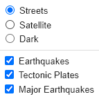
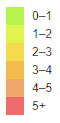

# Mapping_Earthquakes
## Overview
This report creates a website to visualize earthquake data from [earthquake.usgs.gov](https://earthquake.usgs.gov). It will visualize earthquakes from the past week by magnitude and plot them on a map using Leaflet, a javascript library. Tectonic plates will be added as lines to show the relationship between earthquake epicenters and tectonic plates. The website will be interactive and the user can switch between different map styles and toggle what data they would like to see.

## Resources
Software: Javascript ES6, html, css, Leaflet v1.8.0, Mapbox, d3, Visual Studio Code 1.71.0  
Data: [Earthquakes](https://earthquake.usgs.gov/earthquakes/feed/v1.0/summary/all_week.geojson),
[Major Earthquakes](https://earthquake.usgs.gov/earthquakes/feed/v1.0/summary/4.5_week.geojson),
[Tectonic Plates](https://raw.githubusercontent.com/fraxen/tectonicplates/master/GeoJSON/PB2002_boundaries.json)  

## Results
To view the website, visit the github pages server of this repository here: [Earthquake_Challenge]()

In order to toggle the earthquake data and map styling, see the box in the top right corner that looks like this when hovering over:

By checking and unchecking the boxes listed the user can see the data displayed on street, satellite, and dark style maps as well as toggling the earthquake and tectonic plate data. All the earthquakes listed on the map are from the past 7 days. The major earthquake box is for earthquakes that are greater than 4.5 magnitude.

The epicenters of each earthquake is displayed by a circle with the radius of the circle based on the magnitue from a scale from 0 to 10. See the legend in the bottom right that details the differing colors by magnitude.

